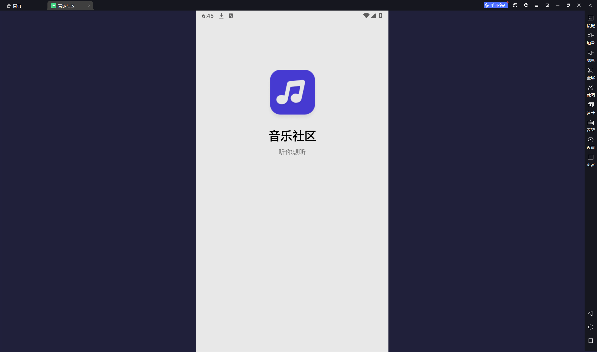

# 实践课程-⾳乐社区第三天晚上

APK：

[music_day3晚上.apk](APK/music_day3%E6%99%9A%E4%B8%8A.apk)

视频：

[music_day3晚上.mp4](media/music_day3%E6%99%9A%E4%B8%8A.mp4)

截图：

# 实践课程-⾳乐社区第三天

APK：

[music_day3.apk](APK/music_day3.apk)

初版视频：

[music_day3.mp4](media/music_day3.mp4)

截图：

# 实践课程-⾳乐社区第二天

APK：

[music_day2.apk](APK/music_day2.apk)

视频：

[music_day2.mp4](media/music_day2.mp4)

截图：

# 实践课程-⾳乐社区第⼀天

6.28晚界面改进：

运行截图：

演示视频：

[music_day1.mp4](media/music_day1.mp4)

